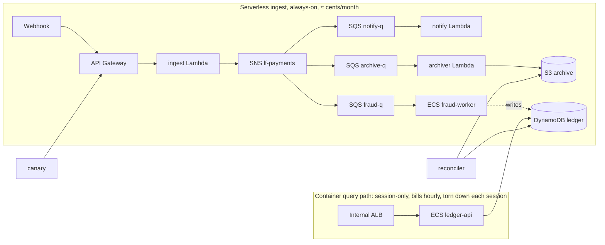

# LedgerFlow

A production-shaped fintech platform on AWS with two ingress paths, serverless and container, built with **Terraform** and **Go**. It covers webhook ingest, durable async fan-out, an idempotent ledger, an internal query API, a status page, and end-to-end observability.

> **What this is:** a hands-on **AWS / SRE learning build**. LedgerFlow is a fictional platform (no real money, no real customers); the deliverable is the engineering itself: the infrastructure-as-code, the debugging, the game-day write-ups, and the design decisions. It's built the hard way on purpose, with no NAT gateway, zero open egress, least privilege from day one, passwordless CI, and a teardown-and-rebuild discipline verified every session.

---

## Architecture

Two ingress paths, split by **how they bill**. That billing split drives most of the design.



- **Serverless path** (API Gateway → Lambda → SNS → SQS fan-out → DynamoDB/S3) costs cents and stays up 24/7.
- **Container path** (internal ALB → ECS Fargate) bills by the hour, so it's destroyed after every session and rebuilt on demand.
- The whole system runs in a **locked-down VPC with no NAT and no `0.0.0.0/0` egress**. Every workload reaches AWS only through exact VPC endpoints.

---

## Tech & AWS services

**IaC / language:** Terraform ≥ 1.10 (native S3 state locking), Go ≥ 1.22, Docker (arm64).
**Identity & governance:** AWS Organizations, IAM Identity Center (SSO), GitHub OIDC (no stored CI secrets), permission boundaries, IAM Access Analyzer, CloudTrail (org trail), AWS Budgets.
**Compute & data:** Lambda, ECS on Fargate (+ Fargate Spot), API Gateway (HTTP API), DynamoDB (single-table), S3, ECR.
**Messaging:** SNS → SQS fan-out with DLQs and redrive.
**Networking & edge:** VPC (no NAT), VPC endpoints (gateway + interface), ALB (internal), CloudFront (OAC), Route 53, ACM.
**Observability:** CloudWatch (EMF metrics, burn-rate alarms, dashboards, Logs Insights), X-Ray via OpenTelemetry/ADOT, EventBridge Scheduler, SLOs with error budgets.

---

## Repository layout

```
ledgerflow/
├─ ledgerflow-complete.md     # THE SPEC: 27 services (S01-S27), Verify gates, cost model, game days
├─ docs/                      # The "why" wiki; read general_guide.md first
│  ├─ general_guide.md        #   start here: what everything is + how to use it
│  ├─ concepts/   (9)         #   cross-cutting concepts, tradeoffs, failure modes
│  ├─ decisions/  (8)         #   a dossier per [you decide] item (options + tradeoffs)
│  ├─ sessions/   (6)         #   per-session prep: arc, traps, predict targets, Verify checklist
│  ├─ services/   (27)        #   per-service build reference (what each Verify really tests)
│  ├─ adr/                    #   Architecture Decision Records (the decisions made)
│  ├─ runbooks/               #   operational procedures
│  └─ gamedays/               #   resilience game-day write-ups (the portfolio centrepiece)
├─ infra/                     # Terraform, one root per layer
│  ├─ 00-foundation/          #   forever: hosted zone, ECR, state bucket, cert, OIDC
│  ├─ 10-serverless/          #   always-on: API GW, Lambda, SNS, SQS, DynamoDB, S3
│  ├─ 20-network/             #   session-only: VPC, subnets, SGs, VPC endpoints
│  └─ 30-compute/             #   session-only: ALB, ECS, CloudFront
├─ services/                  # Go: ledger-api, fraud-worker (containers)
├─ functions/                 # Go: ingest, notify, archiver, canary, reconciler (Lambdas)
├─ loadgen/                   # Go load generator + chaos injector
├─ my_log.md                  # session log + predictions (predict-before-you-test)
└─ justfile                   # up / down / status / cost
```

*(The `00-org` layer lives in the management account. Layer split = independent Terraform state per lifecycle, so the hourly half can be destroyed without touching the always-on half.)*

---

## How to build & run it

**Prerequisites** (S01): AWS CLI v2, Terraform ≥ 1.10, `tflint`, `infracost`, Go ≥ 1.22, Docker with an arm64 builder.

**Accounts & auth.** An AWS Organization with two accounts, reached by SSO profiles (no long-lived keys anywhere):

```bash
aws sso login --profile lf-dev      # workload account
aws sso login --profile lf-mgmt     # management account (billing, org trail)
```

**The session workflow.** The always-on serverless layers stay up (cents/month); the expensive layers come up and down each session:

```bash
just up        # terraform apply 20-network, then 30-compute
just status    # list ALBs / ECS services / NAT gateways (must show 0)
just down      # terraform destroy 30-compute, then 20-network
just cost      # infracost on changed layers
```

**Teardown discipline matters:** `just down && just up` must complete hands-off. If the rebuild ever feels risky, the IaC is wrong.

**Region:** `us-east-2` everywhere, except the CloudFront cert and billing alarm (`us-east-1`, an AWS requirement).

---

## Notable engineering decisions

The decisions that make this more than a tutorial (each has an ADR / dossier in `docs/`):

- **No NAT gateway, zero open egress.** Private workloads reach AWS only through exact VPC endpoints, so a missing endpoint fails loudly instead of silently working.
- **Internal ALB.** The query API serves internal staff only and never touches the public internet; you reach it via SSM port-forward.
- **Passwordless CI.** GitHub Actions authenticates via OIDC with a `sub`-claim-pinned trust policy, so fork PRs can't assume the deploy role and the repo holds no AWS secrets.
- **Least privilege + permission boundaries.** Every Lambda and task has an exact role, and a boundary proves the CI role can't escalate.
- **Exactly-once effects on at-least-once delivery.** SNS-to-SQS fan-out with idempotent, conditional-write consumers, and money stored as integer cents.
- **Single-table DynamoDB.** Access-pattern-first modeling, no scans.
- **SLOs with error budgets + multi-window burn-rate alarms.** Alerts fire on user-facing symptoms, not raw error counts.
- **DR drill.** Destroy *everything* (data exported first), rebuild from code, target RTO under 1 hour.
- **Cost drives the design.** A $30/mo ceiling with a two-mechanism billing alert, and the architecture is split by billing shape.

Ground rules throughout: **IaC only** (console is read-only), **no long-lived credentials**, **least privilege from day one**, **everything tagged**.

---

## Documentation

The design is documented as a "why, not how" wiki in [`docs/`](docs/): about 46k words across 9 concept pages, 8 decision dossiers, 6 session briefs, and 27 per-service references, all cross-linked.

**Start with [`docs/general_guide.md`](docs/general_guide.md)** for the full orientation, then [`docs/README.md`](docs/README.md) as the index. The authoritative requirements live in [`ledgerflow-complete.md`](ledgerflow-complete.md).

---

## Status

**Early build.** The complete design, per-service requirements, and the documentation wiki are **done**. The infrastructure is being built out layer by layer in the spec's dependency order, currently at the account and identity foundation. Progress is tracked in [`my_log.md`](my_log.md). This README describes the target system; folders like `infra/`, `services/`, and `functions/` fill in as each session lands.
