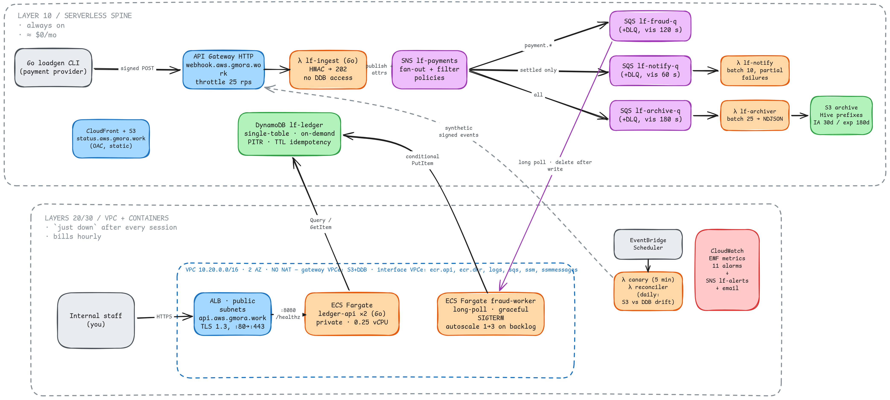

# LedgerFlow — Complete Design & Requirements Document

**The single source of truth for the project: architecture (Part I) + per-service requirements (Part II) + appendices.** Supersedes v1 and v2.

How to use this document: read Part I once to load the mental model, then work exclusively from Part II in build order — each service spec is parameter-level and has a **Verify** line that defines "done". Genuine design decisions are marked **[you decide]** with the constraint stated; each one requires a short ADR in `docs/adr/`. Everything else is given. Gates matter: don't start a service whose dependencies haven't passed their Verify items, or later layers' bugs will masquerade as earlier layers' bugs (your Cilium/Flux bootstrap lesson, generalized).

---

# Part I — System design

## 1. The scenario

You are the sole platform/SRE engineer for a fictional small fintech, **LedgerFlow**, that receives payment webhooks from upstream payment providers (think Stripe/OpenPay-style callbacks). The company needs:

1. A **webhook ingestion endpoint** that never loses an event, even if downstream systems are down.
2. Asynchronous **fan-out processing**: fraud scoring, customer notification, and immutable archival — independently, in parallel, with retries.
3. A **ledger** of processed transactions with fast lookups by customer and by transaction ID.
4. A **query API** for internal staff to search the ledger.
5. A public **status page**.
6. **Observability, SLOs, alarms, and runbooks** — because you're the one on call.
7. Everything reproducible from `git clone` + `terraform apply`. No console-created resources in the final state.

This mirrors your actual work domain but forces you through the AWS-native versions of everything you currently do with WildFly/ActiveMQ/Kubernetes/Grafana.

### Deliberate design decision: two ingress paths

- **Serverless path** (API Gateway → Lambda → SNS): the webhook ingest. Costs effectively $0 at your traffic levels and can stay deployed 24/7.
- **Container path** (ALB → ECS Fargate, Go): the query API. This is the part you tear down after each session, because ALB + Fargate bill hourly.

This split is itself a lesson: in real AWS shops, "what can stay up for free" vs. "what bills by the hour" drives architecture more than people admit.

---

## 2. Services covered (the checklist)

| Category | Services |
|---|---|
| Compute | ECS Fargate, Lambda (Go, `provided.al2023` + `aws-lambda-go`) |
| Networking | VPC, subnets, route tables, security groups, VPC endpoints, ALB |
| Edge/DNS | Route 53 (subdomain delegation from `gmora.work`), ACM, CloudFront |
| API | API Gateway (HTTP API), ALB |
| Messaging | SNS, SQS (+ DLQs), EventBridge (bus + scheduler) |
| Data | DynamoDB (single-table), S3 (archive + lifecycle), optional Aurora Serverless v2 |
| Registry | ECR |
| Identity | IAM (roles, policies, permission boundaries), IAM Identity Center, GitHub OIDC federation |
| Secrets/Config | SSM Parameter Store |
| Observability | CloudWatch Logs/Metrics/Alarms/Dashboards, X-Ray or ADOT, custom metrics (EMF) |
| Governance | AWS Budgets, Cost Explorer, tagging, CloudTrail |
| IaC | Terraform (S3 backend, native lockfile), GitHub Actions |

That's ~20 services composed into one coherent system, which is the actual skill interviews probe: not "do you know SQS" but "why SNS→SQS and not SQS alone, and what happens when the consumer dies."

---

## 3. Ground rules (non-negotiable constraints)

- **G1 — IaC only.** Console is for *reading* (dashboards, logs, exploring). Any resource you click into existence must be recreated in Terraform before the phase counts as done. Exception: the initial account/Identity Center bootstrap (chicken-and-egg, same as your Cilium/Flux problem).
- **G2 — Budget: $30/month hard ceiling, $15 target.** AWS Budgets alert at 50/80/100% of $30. Billing alarm in `us-east-1` (billing metrics only live there).
- **G3 — Teardown discipline.** `terraform destroy` on the expensive layers (network+ALB+ECS, database) at the end of every session. The serverless layer (API GW, Lambda, SNS, SQS, DynamoDB, S3) stays up — it costs cents. Your destroy/rebuild must be *boring and reliable*; if rebuilding is scary, your IaC is wrong.
- **G4 — No long-lived credentials.** No IAM users with access keys. You authenticate via IAM Identity Center (`aws sso login`); GitHub Actions authenticates via OIDC.
- **G5 — Least privilege from day one.** No `"Action": "*"` outside the Terraform admin role. Every Lambda and ECS task gets its own role scoped to exactly what it touches.
- **G6 — Region:** `us-east-2` (Ohio). Cheapest tier, full service coverage, low latency from Monterrey. (`mx-central-1` exists since 2025 but has a smaller service catalog and higher prices — check it out as a curiosity, don't build there.)
- **G7 — Everything tagged.** `project`, `layer`, `managed-by` at minimum, enforced via Terraform `default_tags`. You will use these in Cost Explorer to answer "what did the ALB actually cost me."

---

## 4. Architecture overview

<p align="center">
    
</p>

The **fraud-worker on Fargate** (not Lambda) is deliberate: you must experience the difference between "SQS triggers Lambda for me" and "my long-running consumer owns the poll loop, visibility timeout, heartbeat, and graceful shutdown" — the ActiveMQ-consumer problem you already know, in AWS clothes.

---


---

# Part II — Per-service requirements

**Global naming convention:** `lf-<thing>` for resources, `lf/<thing>` for ECR repos, `/lf/dev/<path>` for SSM parameters. Single environment: `dev`.
**Region:** `us-east-2` for everything except the CloudFront ACM cert and the billing alarm (both `us-east-1`, AWS requirement).

---

## 5. Build order (start here)

Dependency-driven order. Don't skip ahead; later services reference earlier ones by SSM parameter or remote state.

```
Session 1-2   → S01 tooling, S02 account+identity, S03 budgets/billing, S04 CloudTrail
Session 2-3   → S05 Terraform backend + repo layout, S06 GitHub OIDC + CI skeleton
Session 4-6   → S07 Route53, S08 SSM tree, S09 S3 buckets, S10 DynamoDB,
                S11 SNS, S12 SQS, S13 Lambda(ingest+archiver), S14 API Gateway
                ← end of these: first end-to-end event flow, all ≈ free, stays up
Session 7-10  → S15 VPC, S16 VPC endpoints, S17 security groups, S18 ACM,
                S19 ECR, S20 ALB, S21 ECS (api + worker), S22 CloudFront+status
Session 11-13 → S13 remaining Lambdas (notify, canary, reconciler),
                S23 EventBridge Scheduler, S24 CloudWatch (metrics/alarms/dashboard)
Session 14+   → S26 IAM hardening pass, S27 game days & DR drill
```

The load generator (S25) is built incrementally: a minimal signed-request version alongside S13/S14 (its Verify items need it), the full `--chaos`/latency-histogram version before S27.

**Session 1 is exactly this:** install AWS CLI v2, Terraform ≥ 1.10, `tflint`, `infracost`; secure root (S02.1–S02.2); enable Identity Center (S02.3–S02.6); prove `aws sts get-caller-identity` works over SSO. That's a 3-hour Saturday. Session 2: S03 + S04 + start S05.

---

## S01 — Local tooling

| # | Requirement |
|---|---|
| 1.1 | AWS CLI v2 (not v1), configured with SSO profile named `lf-dev`, `region = us-east-2`, `output = json` |
| 1.2 | Terraform ≥ 1.10 (native S3 lockfile support required) via your preferred version manager |
| 1.3 | `tflint` with the `aws` ruleset plugin; config committed at repo root (`.tflint.hcl`) |
| 1.4 | `infracost` authenticated (free tier) |
| 1.5 | Go ≥ 1.22, `golangci-lint`; Docker with buildx (you'll build `linux/arm64` images) |
| 1.6 | Pre-commit hook or `just check` target running: `terraform fmt -check`, `tflint`, `golangci-lint run` |

Verify: `aws --version` shows 2.x; `terraform version` ≥ 1.10; `docker buildx ls` shows an arm64-capable builder.

---

## S02 — Account & IAM Identity Center

| # | Requirement |
|---|---|
| 2.1 | Root MFA enabled on **both** account roots (management + dev; the management root is the org crown jewel), no access keys on either (`aws iam get-account-summary` → `AccountAccessKeysPresent: 0`) |
| 2.2 | Account-level: default EBS encryption on; S3 Block Public Access on at account level; `us-east-2` + `us-east-1` only (optional: disable unused regions via… you can't fully, but set an SCP later in stretch X4) |
| 2.3 | IAM Identity Center enabled. This **requires** an AWS Organization (enabling Identity Center creates one if absent), so the org is mandatory, not optional. Org kept: `mora-management` (payer/management) + `mora-dev` (all workload). Extra workload accounts, SCPs, and delegated admin are stretch X4. |
| 2.4 | One user (you), MFA enforced |
| 2.5 | Permission set `LedgerFlowAdmin`: AWS-managed `AdministratorAccess`, session duration **8h** |
| 2.6 | CLI: `aws configure sso` → profile `lf-dev`; no `[default]` credentials block containing keys anywhere in `~/.aws/credentials` |

Verify: `aws sts get-caller-identity --profile lf-dev` returns an `assumed-role/AWSReservedSSO_LedgerFlowAdmin...` ARN.

**Senior note:** Identity Center is bootstrap-by-console — the one sanctioned exception to IaC-only. Document it in `docs/bootstrap.md` (exact clicks) so the account is still reproducible-by-instructions.

---

## S03 — Budgets & billing alarms

| # | Requirement | Value |
|---|---|---|
| 3.1 | AWS Budget `lf-monthly` (**management account** — consolidated billing covers both accounts) | $30 USD, monthly, cost type: unblended, ACTUAL alerts at 50% / 80% / 100% + FORECASTED at 100%, email to you |
| 3.2 | SNS topic `lf-alerts` (us-east-2) | Email subscription (confirm it), used by all alarms in S25 |
| 3.3 | SNS topic `lf-billing-alerts` (**management account, us-east-1**) | Email subscription |
| 3.4 | CloudWatch alarm `lf-billing-20usd` (**management account, us-east-1**) | `AWS/Billing EstimatedCharges` only surfaces in the payer/management account (member-account charges roll up there), which is why 3.1/3.3/3.4 all live in management. Requires enabling billing alerts in account prefs (console, document it), threshold ≥ $20, period 6h, 1 datapoint, → 3.3 |
| 3.5 | Mechanism test | Temporarily set a $1 budget, receive the email, delete it. An untested alert doesn't exist. |

---

## S04 — CloudTrail

| # | Requirement | Value |
|---|---|---|
| 4.1 | Trail `lf-audit` (**organization trail**, created in the management account) | Multi-region, org-wide (captures both accounts into one bucket), **management events only** (data events cost money and you don't need them), log file validation on |
| 4.2 | Destination bucket `lf-audit-<mgmt-account-id>` (management account) | SSE-S3, Block Public Access, **org-trail** bucket policy template (it differs from the single-account one — the policy must allow the org's member accounts), lifecycle: expire objects at 90 days |
| 4.3 | Skill requirement | Run one `aws cloudtrail lookup-events --lookup-attributes AttributeKey=EventName,AttributeValue=CreateBucket` and read the output. You'll use this when Terraform confuses you. |

---

## S05 — Terraform backend, repo & state layout

| # | Requirement | Value |
|---|---|---|
| 5.1 | State bucket `lf-tfstate-<account-id>` | Versioning ON, SSE-S3, Block Public Access, lifecycle: keep 30 noncurrent versions |
| 5.2 | Backend config per layer | `use_lockfile = true`; **no DynamoDB lock table** (legacy pattern) |
| 5.3 | State keys | `00-org/tf.tfstate` (**management account**), `00-foundation/tf.tfstate`, `10-serverless/tf.tfstate`, `20-network/tf.tfstate`, `30-compute/tf.tfstate` |
| 5.4 | Bootstrap sequence | Bucket created by `00-foundation` with local state first, then `terraform init -migrate-state`. Document the chicken-and-egg in `docs/bootstrap.md` — same class of problem as your Cilium/Flux bootstrap. |
| 5.5 | Layer contents | **00-org (management acct): S03 budget + billing alarm, S04 org trail.** 00-foundation (dev acct): S02 remnants, S06, S07, S18 cert A (see 18.4), S19. 10: S08–S14, S23, S24, most of S25. 20: S15–S17. 30: S20–S22 + compute alarms. |
| 5.6 | Cross-layer wiring | **[you decide, ADR]** default: producers write outputs to SSM `/lf/dev/tf/<layer>/<name>`, consumers read via `data "aws_ssm_parameter"`. Chosen over `terraform_remote_state` because the cross-layer value set is small (VPC/subnet/SG IDs, ARNs) and remote_state grants read of the producer's *entire* state file — a weaker least-privilege story. Alternative to weigh in the ADR: remote_state guarded by a dedicated read-only state IAM role. |
| 5.7 | Provider `default_tags` | `project=ledgerflow`, `layer=<NN-name>`, `managed-by=terraform`, `repo=github.com/m0r4a/<repo>` |
| 5.8 | Repo layout | `infra/{00-foundation,10-serverless,20-network,30-compute}/`, `services/{ledger-api,fraud-worker}/`, `functions/{ingest,notify,archiver,canary,reconciler}/`, `loadgen/`, `docs/{runbooks,gamedays,adr}/`, `justfile` |
| 5.9 | `justfile` targets | `up` (apply 20 then 30), `down` (destroy 30 then 20), `status` (list ALBs, ECS services, NAT GWs — should print NAT count 0), `cost` (infracost on changed dirs) |
| 5.10 | Version pins | `required_version` and AWS provider version pinned with `~>` in every layer; `.terraform.lock.hcl` committed |
| 5.11 | Provider auth | Two SSO profiles: `lf-mgmt` (management account, used only by `00-org`) and `lf-dev` (dev account, all other layers). No cross-account role assumption yet — each layer targets exactly one account. |
| 5.12 | Destroy guards | `prevent_destroy = true` on the always-on stateful resources: Route53 hosted zone, tfstate bucket, audit bucket, ECR repos, DynamoDB table. Documented one-line override in `docs/runbooks/dr-drill.md` for the R9.3 DR drill (the only sanctioned destroy of the data layer). |

Verify: two concurrent `terraform apply` runs in one layer → second fails on lock. `just down && just up` completes hands-off.

---

## S06 — GitHub OIDC & CI

| # | Requirement | Value |
|---|---|---|
| 6.1 | OIDC provider | URL `https://token.actions.githubusercontent.com`, audience `sts.amazonaws.com` |
| 6.2 | Role `lf-gha-plan` | Trust condition `sub` = `repo:m0r4a/<repo>:pull_request`; policy: `ReadOnlyAccess` (AWS-managed) + `s3:GetObject/ListBucket` on state bucket + `ssm:GetParameter` on `/lf/dev/tf/*`. Plan-only. |
| 6.3 | Role `lf-gha-deploy` | Trust condition `sub` = `repo:m0r4a/<repo>:ref:refs/heads/main` **exactly** — no `*` in the repo segment ever; policy: ECR push to `lf/*` repos, `ecs:UpdateService/RegisterTaskDefinition/DescribeServices`, `iam:PassRole` on the two task/exec roles only, with `iam:PassedToService=ecs-tasks.amazonaws.com` condition |
| 6.4 | Workflow `terraform-ci.yml` | On PR touching `infra/**`: fmt-check, validate, tflint, plan per changed layer, plan posted as PR comment. No apply in CI (apply is you, locally — right choice at this maturity). |
| 6.5 | Workflow `build-deploy.yml` | On push to `main` touching `services/**` or `functions/**`: `go vet`, `golangci-lint`, `go test ./...`, build, push, deploy (S19/S21 detail the image and deploy contract) |
| 6.6 | Zero GitHub repo secrets | The repo's Actions secrets list is empty except the role ARNs (which aren't secret; use repo *variables*) |

Verify: a PR from a fork cannot assume either role (test it or reason through the `sub` claim and write the reasoning in an ADR).

---

## S07 — Route 53

| # | Requirement | Value |
|---|---|---|
| 7.1 | Public hosted zone | `aws.gmora.work`, in layer 00, never destroyed ($0.50/mo) |
| 7.2 | Delegation | 4 NS records added in Cloudflare for `aws.gmora.work` → the zone's NS set; TTL 3600 |
| 7.3 | Records (created by owning layers) | `api.aws.gmora.work` A-alias → ALB (layer 30); `status.aws.gmora.work` A-alias → CloudFront (layer 30); `webhook.aws.gmora.work` A-alias → API GW custom domain (layer 10) |
| 7.4 | No wildcard records | Each name explicit |

Verify: `dig +trace webhook.aws.gmora.work` and follow the delegation hop by hop once — you do DNS for a living-adjacent job; make AWS's side concrete.

---

## S08 — SSM Parameter Store

| # | Requirement | Value |
|---|---|---|
| 8.1 | Parameter tree | `/lf/dev/webhook-hmac` (SecureString, default KMS key), `/lf/dev/config/<per-service keys as needed>`, `/lf/dev/tf/<layer>/<output>` (String, written by Terraform) |
| 8.2 | HMAC secret | 32 random bytes hex; generated locally (`openssl rand -hex 32`), written with `aws ssm put-parameter` — **not** in Terraform (secrets in state = plaintext in S3). Terraform references it as a data source with `sensitive = true` only where unavoidable; prefer runtime reads by services. |
| 8.3 | Standard tier only | No advanced-tier parameters (they bill). Standard is free up to 10k params. |
| 8.4 | Rotation runbook | `docs/runbooks/rotate-hmac.md`: put new value → restart consumers → verify old sig rejected. ≤ 10 lines. |

---

## S09 — S3 buckets (complete inventory)

| Bucket | Layer | Config |
|---|---|---|
| `lf-tfstate-<acct>` | bootstrap | Versioning ON, SSE-S3, BPA on, 30 noncurrent versions kept |
| `lf-audit-<acct>` | 00 | SSE-S3, BPA on, CloudTrail bucket policy, expire 90d |
| `lf-archive-<acct>` | 10 | Versioning OFF, SSE-S3, BPA on, lifecycle: → STANDARD_IA at 30d, expire at 180d; policy `Deny` when `aws:SecureTransport=false` |
| `lf-status-<acct>` | 10 (bucket) / 30 (distribution) | BPA on, no website-hosting mode, bucket policy allows `s3:GetObject` only to the CloudFront distribution via OAC condition `AWS:SourceArn` |

| # | Requirement |
|---|---|
| 9.1 | Every bucket: the four Block Public Access flags all true |
| 9.2 | Archive object key format: `events/year=YYYY/month=MM/day=DD/<uuid>.ndjson` (Hive-style, Athena-ready for stretch X3) |
| 9.3 | Verify: `curl https://lf-status-<acct>.s3.us-east-2.amazonaws.com/index.html` → 403; CloudFront URL → 200 |

---

## S10 — DynamoDB

| # | Requirement | Value |
|---|---|---|
| 10.1 | Table `lf-ledger` | On-demand (PAY_PER_REQUEST), **PITR off** (the DR drill R9.3 uses native export/import, not point-in-time restore — don't pay for a capability you never exercise), deletion protection OFF (the DR drill destroys it deliberately), TTL on attribute `expiresAt` |
| 10.2 | Keys | `PK` (S) / `SK` (S); GSI1: `GSI1PK`/`GSI1SK` (S/S, ALL projection); GSI2: `GSI2PK`/`GSI2SK` (S/S, KEYS_ONLY + `amount`,`status` via INCLUDE) |
| 10.3 | Reference schema (deviate only with a written ADR) | **Transaction:** `PK=CUST#<customerId>`, `SK=TXN#<rfc3339ts>#<txnId>`, `GSI1PK=TXN#<txnId>`, `GSI1SK=META`, `GSI2PK=STATUS#<status>#<yyyy-mm-dd>`, `GSI2SK=<rfc3339ts>`, attrs: `amount` (N, cents — never floats for money), `currency`, `status` ∈ {SETTLED, FLAGGED, FAILED}, `fraudScore` (N), `providerEventId`. **Idempotency:** `PK=IDEM#<providerEventId>`, `SK=IDEM`, `expiresAt` = now+7d epoch seconds. |
| 10.4 | Access-pattern → query mapping (commit as `docs/adr/002-dynamodb-schema.md`) | AP1 get-by-txnId → GSI1 GetItem-equivalent Query; AP2 customer history newest-first → Query PK, `ScanIndexForward=false`, paginated; AP3 flagged-in-range → GSI2 Query with SK `BETWEEN`; AP4 idempotency → conditional `PutItem` with `attribute_not_exists(PK)` |
| 10.5 | Code constraints | `aws-sdk-go-v2` + `feature/dynamodb/attributevalue`; expression builder package for conditions; `grep -rn "Scan(" services/ functions/` returns nothing |
| 10.6 | Verify | Replay one webhook 50×: table contains exactly 1 TXN item + 1 IDEM item; the 49 rejects are visible as `ConditionalCheckFailedException` handled gracefully (metric, not error log spam) |

**Senior note:** money as integer cents and idempotency as conditional-write (not read-then-write) are the two things I'd check first in a code review of this table. Race conditions don't care about your read.

---

## S11 — SNS

| # | Requirement | Value |
|---|---|---|
| 11.1 | Topic `lf-payments` | SSE with AWS-managed key (`alias/aws/sns`) |
| 11.2 | Publisher | Only `lf-ingest-lambda-role` may `sns:Publish` (its IAM policy; topic access policy stays default-deny-external) |
| 11.3 | Message contract | Body = event JSON; message attributes: `eventType` (String, e.g. `payment.settled` / `payment.failed` / `payment.pending`), `traceparent` (String — this is how trace context crosses the async gap, see S25.6) |
| 11.4 | Subscriptions (all raw message delivery = true) | → `lf-fraud-q`: filter `{"eventType":[{"prefix":"payment."}]}`; → `lf-notify-q`: filter `{"eventType":["payment.settled"]}`; → `lf-archive-q`: no filter |
| 11.5 | Verify | Publish one `payment.failed` via CLI: fraud+archive receive it, notify does not (check `NumberOfMessagesReceived` per queue) |

---

## S12 — SQS

All queues: SSE-SQS on, long polling `ReceiveMessageWaitTimeSeconds=20`, redrive `maxReceiveCount=3` to its DLQ.

| Queue | Visibility timeout | Retention | Consumer |
|---|---|---|---|
| `lf-fraud-q` | 120 s | 4 d | fraud-worker (Fargate, S21) |
| `lf-fraud-dlq` | 30 s | 14 d | you + redrive |
| `lf-notify-q` | 60 s (= 6 × Lambda timeout) | 4 d | notify Lambda |
| `lf-notify-dlq` | 30 s | 14 d | — |
| `lf-archive-q` | 180 s (= 6 × Lambda timeout) | 4 d | archiver Lambda |
| `lf-archive-dlq` | 30 s | 14 d | — |

| # | Requirement |
|---|---|
| 12.1 | Queue policies: `sqs:SendMessage` allowed to `sns.amazonaws.com` with `aws:SourceArn` = the topic — nothing broader |
| 12.2 | Alarm per DLQ: `ApproximateNumberOfMessagesVisible ≥ 1`, 1 datapoint / 5 min → `lf-alerts` (defined in S25 but owned conceptually here) |
| 12.3 | Redrive drill: use **redrive to source** (native SQS feature) after fixing a poison message — no hand-written requeue scripts |

**Senior note:** the 6× visibility-timeout rule is AWS's own guidance; internalize *why* (retries during Lambda's internal retry + batch window) rather than cargo-culting it — it comes up in incident reviews constantly.

---

## S13 — Lambda functions (shared contract + per-function)

Shared requirements for **all five** functions:

| # | Requirement | Value |
|---|---|---|
| 13.1 | Runtime | `provided.al2023`, `arm64`, Go with `aws-lambda-go`; built `CGO_ENABLED=0 GOOS=linux GOARCH=arm64`, zip contains single binary named `bootstrap` |
| 13.2 | Log group | Explicitly Terraform-managed `/aws/lambda/<fn>`, retention **14 days** (never rely on auto-created infinite-retention groups) |
| 13.3 | Tracing | X-Ray active tracing on |
| 13.4 | Logging | Structured JSON (slog), one line per event, includes `traceId`, `eventType`, `providerEventId` where applicable |
| 13.5 | Config | Via env vars set in Terraform; secrets fetched from SSM at cold start and cached |
| 13.6 | No VPC config | All five run outside the VPC (they touch only AWS APIs) — free egress, fast cold starts |

Per-function:

| Function | Memory | Timeout | Trigger | Role may do exactly |
|---|---|---|---|---|
| `lf-ingest` | 128 MB | 5 s | API GW | `ssm:GetParameter` on `/lf/dev/webhook-hmac`, `sns:Publish` on `lf-payments`, logs, xray |
| `lf-notify` | 128 MB | 10 s | SQS ESM: `lf-notify-q`, batch 10, `ReportBatchItemFailures` | SQS consume on `lf-notify-q`, logs, xray |
| `lf-archiver` | 256 MB | 30 s | SQS ESM: `lf-archive-q`, batch 25, window 30 s, `ReportBatchItemFailures` | SQS consume on `lf-archive-q`, `s3:PutObject` on `lf-archive-<acct>/events/*`, logs, xray |
| `lf-canary` | 128 MB | 30 s | EventBridge Scheduler (S24) | `ssm:GetParameter` (hmac), logs, xray — talks to public endpoints only |
| `lf-reconciler` | 256 MB | 60 s | EventBridge Scheduler (S24) | `s3:ListBucket/GetObject` on archive, `dynamodb:Query` on `lf-ledger` + GSI2, logs, xray |

Behavioral requirements:

| # | Requirement |
|---|---|
| 13.7 | `ingest`: constant-time HMAC-SHA256 compare (`hmac.Equal`) of `X-Lf-Signature` header over raw body; bad sig → 401, bad JSON/schema → 422, success → 202 with `{"eventId": "..."}`; publishes with attributes per S11.3; **does not** touch DynamoDB |
| 13.8 | `notify` & `archiver`: partial-batch failure implemented and unit-tested — a batch of 10 with 1 failure returns exactly that 1 `messageId` in `batchItemFailures` |
| 13.9 | `archiver`: aggregates the batch into one NDJSON S3 object per invocation (key per S09.2) |
| 13.10 | `canary`: sends a signed synthetic event with attribute `synthetic=true` (which `fraud-worker` and `notify` drop before side-effects, `archiver` keeps but under `events-synthetic/` prefix); also GETs `https://api.aws.gmora.work/healthz` and tolerates its absence (layer 30 may be down — that's not a canary failure, log and skip); emits EMF metrics `CanaryIngestOk`, `CanaryIngestLatencyMs` |
| 13.11 | `reconciler`: for yesterday (UTC): count archive events vs. GSI2 items across statuses; emit EMF `ReconciliationDrift` (absolute count). Small drift is expected (velocity scoring is racy, S21.11) — WARN only above a documented threshold, not on every off-by-one; drift beyond it → structured WARN log |
| 13.12 | Deploy: zip via CI on `main`; ingest additionally gets `aws lambda update-function-code` + wait-for-active in the workflow |
| 13.13 | `ingest`: reserved concurrency capped (pick a number, e.g. 50) — an explicit blast-radius and cost ceiling so a load-test burst can't fan out to the account default (1000) concurrent executions. Understand reserved (a cap) vs provisioned (pre-warmed against cold starts); ADR the number. |

---

## S14 — API Gateway (HTTP API)

| # | Requirement | Value |
|---|---|---|
| 14.1 | API `lf-ingest-api`, protocol HTTP API (not REST — cheaper, sufficient) | Route `POST /webhook` → Lambda proxy integration, payload format **2.0** |
| 14.2 | Stage | `$default`, auto-deploy on |
| 14.3 | Throttling | Stage-level: rate 25 rps, burst 50 (protects your wallet from a runaway loadgen loop) |
| 14.4 | Access logs | To log group `/lf/apigw/ingest`, retention 14 d, JSON format including `$context.requestId`, `$context.status`, `$context.integrationErrorMessage`, `$context.responseLatency` |
| 14.5 | Custom domain | `webhook.aws.gmora.work`, regional, cert from S18, API mapping to `$default` |
| 14.6 | Verify | Unsigned POST → 401; signed valid → 202 in < 500 ms p99 (measure with loadgen, 10 rps × 2 min) |

---

## S15 — VPC & subnets

| # | Requirement | Value |
|---|---|---|
| 15.1 | VPC | `10.20.0.0/16`, DNS support + DNS hostnames enabled (endpoints' private DNS needs both) |
| 15.2 | Subnets | `lf-public-a` 10.20.0.0/20 (us-east-2a), `lf-public-b` 10.20.16.0/20 (2b), `lf-private-a` 10.20.128.0/20 (2a), `lf-private-b` 10.20.144.0/20 (2b) |
| 15.3 | `map_public_ip_on_launch` | true on public, false on private |
| 15.4 | IGW + routing | Public RT: `0.0.0.0/0 → igw`. **Private RTs (one per AZ): no default route at all.** No NAT Gateway, no NAT instance, nowhere, ever. |
| 15.5 | Flow logs | OFF by default (cost); a commented Terraform block ready to enable to CloudWatch for game days |
| 15.6 | Verify | `just status` prints `NAT gateways: 0`; route table for private-a has exactly local + the two gateway-endpoint prefix-list routes (after S16) |

---

## S16 — VPC endpoints

| Endpoint | Type | Cost | Attached to |
|---|---|---|---|
| `com.amazonaws.us-east-2.s3` | Gateway | free | both private RTs |
| `...dynamodb` | Gateway | free | both private RTs |
| `...ecr.api` | Interface | ~$0.01/h | both private subnets |
| `...ecr.dkr` | Interface | ~$0.01/h | both private subnets |
| `...logs` | Interface | ~$0.01/h | both private subnets |
| `...sqs` | Interface | ~$0.01/h | both private subnets |
| `...ssmmessages` | Interface | ~$0.01/h | both private subnets (ECS Exec transport) |
| `...ssm` | Interface | ~$0.01/h | both private subnets (secret injection at task start) |

| # | Requirement |
|---|---|
| 16.1 | All interface endpoints: `private_dns_enabled = true`, SG = `lf-vpce-sg` (S17) |
| 16.2 | All of S16 lives in layer 20 → dies with `just down` (interface endpoints are the layer's main hourly cost, ~$0.06/h total) |
| 16.3 | Verify (the classic): a Fargate task in private-a pulls from ECR **and** you can explain which of the three endpoints (ecr.api / ecr.dkr / s3-gateway) served which part of the pull. If the pull hangs, one of the three is missing/misconfigured — that debugging session is a core deliverable of this project; write it up. |
| 16.4 | Verify negative: ECS Exec into a task, `curl -m 5 https://checkip.amazonaws.com` fails (no internet path). This failure is an acceptance test. |

---

## S17 — Security groups

| SG | Inbound | Outbound |
|---|---|---|
| `lf-alb-sg` | 443/tcp from within the VPC / a bastion SG (**internal ALB — no `0.0.0.0/0`**); optional 80/tcp same source for the redirect | 8080/tcp to `lf-api-sg` |
| `lf-api-sg` | 8080/tcp from `lf-alb-sg` (SG reference, never CIDR) | 443/tcp to `lf-vpce-sg`; 443/tcp to prefix lists of the two gateway endpoints |
| `lf-worker-sg` | none | same outbound as `lf-api-sg` |
| `lf-vpce-sg` | 443/tcp from `lf-api-sg` and `lf-worker-sg` | none needed |

| # | Requirement |
|---|---|
| 17.1 | Zero `0.0.0.0/0` egress rules anywhere in layers 20/30. Locked-down egress is unusual and deliberate: every "it can't connect" error becomes a security-group lesson instead of silently working. |
| 17.2 | Every rule has a `description` |
| 17.3 | Verify: `aws ec2 describe-security-groups --filters Name=tag:project,Values=ledgerflow` piped through jq shows no `0.0.0.0/0` egress |

---

## S18 — ACM

| # | Requirement | Value |
|---|---|---|
| 18.1 | Cert A (us-east-2, **always-on layer — 00 or 10, see 18.4, not 20**) | CN `api.aws.gmora.work`, SAN `webhook.aws.gmora.work` — used by the ALB (layer 30, referenced by ARN via SSM) and the API GW custom domain (layer 10) |
| 18.2 | Cert B (us-east-1, layer 30, provider alias) | CN `status.aws.gmora.work` — CloudFront requires us-east-1; this is the multi-provider-alias Terraform exercise |
| 18.3 | Validation | DNS, fully automated: `aws_acm_certificate` → `aws_route53_record` (for_each over domain_validation_options) → `aws_acm_certificate_validation` |
| 18.4 | Cert A also serves the always-on webhook custom domain (layer 10), so it **cannot** live in layer 20 — tearing down 20 each session would kill the 24/7 endpoint (violates G3). The real decision is **[you decide]** 00-foundation vs 10-serverless, both always-on. The ALB in layer 30 references the cert by ARN (via SSM, per 5.6). Write ADR-003. ACM certs are free and idle certs cost nothing. |

---

## S19 — ECR

| # | Requirement | Value |
|---|---|---|
| 19.1 | Repos | `lf/ledger-api`, `lf/fraud-worker` — layer 00 (images should survive `just down`) |
| 19.2 | Config | `IMMUTABLE` tags, scan-on-push on, lifecycle policy: expire untagged after 7d, keep last 10 tagged |
| 19.3 | Tagging contract | Images tagged with full 40-char git SHA only. No `latest` anywhere — not in CI, not "just to test". |
| 19.4 | Images | Multi-stage Dockerfile: build stage → `gcr.io/distroless/static` (or `scratch` + your own ca-certs/tzdata — **[you decide]**, ADR it), `USER nonroot`, `linux/arm64`, final size < 25 MB |
| 19.5 | Verify | `docker inspect` shows non-root numeric UID; ECR scan: zero CRITICAL findings |

---

## S20 — ALB

| # | Requirement | Value |
|---|---|---|
| 20.1 | ALB `lf-alb` | **internal** (scheme `internal`) — the query API is internal-staff-only (§1.4), so it must not sit on the public internet; subnets: both **private**, SG `lf-alb-sg`, `drop_invalid_header_fields = true`, idle timeout 60 s. Reach it from your laptop via SSM port-forward or a bastion, not the open internet. |
| 20.2 | Listener :80 | Fixed action: redirect 301 → https |
| 20.3 | Listener :443 | Cert A, SSL policy `ELBSecurityPolicy-TLS13-1-2-2021-06`, default action → `lf-api-tg` |
| 20.4 | Target group `lf-api-tg` | target_type `ip` (Fargate requirement), port 8080, HTTP; health check: path `/healthz`, interval 15 s, timeout 5 s, healthy 2, unhealthy 3; `deregistration_delay = 30` |
| 20.5 | DNS | `api.aws.gmora.work` A-alias → ALB, created in layer 30 (dies and returns with the layer — everything must reference the name, never IPs) |
| 20.6 | Access logs | OFF by default; commented block ready (S3 target) for game days |

---

## S21 — ECS (cluster, services, autoscaling, IAM)

| # | Requirement | Value |
|---|---|---|
| 21.1 | Cluster `lf-dev` | Fargate + Fargate Spot capacity providers registered; Container Insights **disabled** (it bills per metric; default AWS/ECS metrics suffice here) |
| 21.2 | Shared execution role `lf-task-exec` | AWS-managed `AmazonECSTaskExecutionRolePolicy` + `ssm:GetParameters` on `/lf/dev/*` + `kms:Decrypt` on the SSM default key. Understand: this role pulls images and injects secrets *before* your code runs. |
| 21.3 | Task role `lf-ledger-api-task` | `dynamodb:GetItem,Query` on table + both GSI ARNs; `ssmmessages:*` (ECS Exec); xray write. Nothing else. |
| 21.4 | Task role `lf-fraud-worker-task` | `dynamodb:PutItem,GetItem,Query,UpdateItem` on table ARNs; `sqs:ReceiveMessage,DeleteMessage,GetQueueAttributes,ChangeMessageVisibility` on `lf-fraud-q` only; `ssmmessages:*`; xray write |
| 21.5 | Task def `ledger-api` | 256 CPU / 512 MB, `ARM64`, awsvpc; container port 8080; `awslogs` → `/lf/ecs/ledger-api` (14 d, Terraform-managed); env: `TABLE_NAME`, `PORT=8080`; ulimit nofile 65536; `readonlyRootFilesystem = true` |
| 21.6 | Task def `fraud-worker` | Same sizing/logging pattern; env: `QUEUE_URL`, `TABLE_NAME`; `readonlyRootFilesystem = true` |
| 21.7 | Service `ledger-api` | desired 2, spread across both private subnets, `lf-api-sg`, behind `lf-api-tg`, `health_check_grace_period = 30`, deployment min 100% / max 200%, **deployment circuit breaker on with rollback**, ECS Exec enabled |
| 21.8 | Service `fraud-worker` | desired 1, no LB, ECS Exec enabled, capacity: **[you decide]** Fargate vs Fargate Spot (worker is interruption-tolerant by design — is it really? What happens to an in-flight message on SIGTERM? You built graceful drain; Spot gives 120 s warning. ADR it.) |
| 21.9 | Worker autoscaling | App Auto Scaling target 1→3; target-tracking on **backlog per task** = `ApproximateNumberOfMessagesVisible / RunningTaskCount` via CloudWatch metric math, target 30; scale-in cooldown 300 s, scale-out 60 s |
| 21.10 | Go: `ledger-api` | Endpoints: `GET /healthz` (liveness: 200 always if process up), `GET /readyz` (checks a cheap DynamoDB call once/10 s cached), `GET /transactions/{id}` (AP1), `GET /customers/{id}/transactions?limit=&cursor=` (AP2, cursor = base64 of `LastEvaluatedKey`), `POST /transactions/search` (AP3: `{"status": "...", "from": "...", "to": "..."}`). Mat Ryer server pattern, `http.Server` timeouts set (Read 5 s / Write 10 s / Idle 60 s), graceful shutdown on SIGTERM ≤ 25 s |
| 21.11 | Go: `fraud-worker` | Long-poll loop (wait 20 s, max 10 msgs); per message: drop if `synthetic=true`, idempotency conditional-put, score (rules: amount > 500 000 cents → +40; > 3 events same customer in 60 s → +30 — needs the velocity Query; score ≥ 50 → status FLAGGED else SETTLED), write TXN item, delete message. SIGTERM: stop receiving, finish in-flight, exit < 25 s. Extend visibility (`ChangeMessageVisibility`) if a message will exceed 60 s. **Velocity scoring is best-effort:** with up to 3 concurrent workers and at-least-once delivery, the velocity Query can undercount (two workers score the same customer in parallel). Accepted, not fixed — do not serialize. Idempotency stays exact regardless (conditional write, not read-then-count). |
| 21.12 | Deploy contract (CI) | Register new task-def revision with new image SHA → `ecs update-service` → `aws ecs wait services-stable` → fail the job if rollback triggered |
| 21.13 | Verify | S16.3/16.4 pass; kill-one-task-under-load → zero 5xx at the ALB; 500-message flood → scales to 3, drains, returns to 1; measure drain time and compare to your Little's-Law prediction *made beforehand* |

---

## S22 — CloudFront + status page

| # | Requirement | Value |
|---|---|---|
| 22.1 | Distribution | Origin: `lf-status-<acct>` via **Origin Access Control** (not legacy OAI); default root object `index.html`; viewer protocol redirect-to-https; managed cache policy `CachingOptimized`; `PriceClass_100`; alias `status.aws.gmora.work`; cert B |
| 22.2 | Content | Hand-written static `index.html` listing components + "last verified" date. (Stretch: canary writes a JSON the page fetches.) |
| 22.3 | Layer | Distribution in 30 — **[you decide]**: CloudFront distributions take ~5 min to create/delete, which makes `just up/down` slow. Moving it to 10 (always-on, ≈$0 at zero traffic) is defensible. ADR it. |
| 22.4 | Verify | Direct bucket URL → 403; `https://status.aws.gmora.work` → 200; response header shows `x-cache` |

---

## S23 — EventBridge Scheduler

| # | Requirement | Value |
|---|---|---|
| 23.1 | Schedule `lf-canary-5m` | `rate(5 minutes)`, flexible window OFF, target `lf-canary`, dedicated scheduler role with `lambda:InvokeFunction` on that one function; `state` driven by TF var `canary_enabled` (default false — enable during sessions/game days, or leave on: ~8 640 invocations/mo, still free tier — **[you decide]**, do the arithmetic first) |
| 23.2 | Schedule `lf-reconciler-daily` | `cron(30 7 * * ? *)` UTC (01:30 Monterrey), always ENABLED, same pattern |
| 23.3 | Verify | Disable→enable canary via `terraform apply -var canary_enabled=true` only — no console toggling |

---

## S24 — CloudWatch (logs, metrics, alarms, dashboard)

**Log groups (all Terraform-managed, retention 14 d):** `/aws/lambda/lf-{ingest,notify,archiver,canary,reconciler}`, `/lf/apigw/ingest`, `/lf/ecs/{ledger-api,fraud-worker}`.

**Custom metrics — EMF only, namespace `LedgerFlow`** (no `PutMetricData` calls in hot paths):

| Metric | Unit | Dimensions | Emitted by |
|---|---|---|---|
| `EventsIngested` | Count | `eventType` | ingest |
| `EventsRejected` | Count | `reason` (badsig/badschema) | ingest |
| `FraudFlagged` | Count | — | fraud-worker |
| `ProcessingLatencyMs` | ms | — (event ts → ledger write ts) | fraud-worker |
| `CanaryIngestOk` | Count (0/1) | — | canary |
| `CanaryIngestLatencyMs` | ms | — | canary |
| `ReconciliationDrift` | Count | — | reconciler |

Keep total custom metric streams < 10 — each metric×dimension-set bills ~$0.30/mo after free tier.

**Alarms (all → `lf-alerts` SNS):**

| Alarm | Metric / expression | Threshold |
|---|---|---|
| `lf-dlq-fraud`, `-notify`, `-archive` | `ApproximateNumberOfMessagesVisible` (DLQ) | ≥ 1, 1×5 min |
| `lf-fraud-backlog-age` | `ApproximateAgeOfOldestMessage` (`lf-fraud-q`) | > 300 s, 2×5 min |
| `lf-ingest-errors-fast` | metric math: Lambda `Errors`/`Invocations` (ingest) | > 5% over 5 min (fast burn) |
| `lf-ingest-errors-slow` | same | > 1% over 1 h (slow burn) |
| `lf-canary-fail` | `CanaryIngestOk` | < 1 for 3×5 min, `treat_missing_data = breaching` when canary enabled |
| `lf-api-5xx` | ALB `HTTPCode_Target_5XX_Count` | ≥ 5 in 5 min |
| `lf-api-p99` | ALB `TargetResponseTime` p99 | > 0.5 s, 3×5 min |
| `lf-recon-drift` | `ReconciliationDrift` | > 0, 1×1 day |
| `lf-lambda-throttles` | `Throttles` (all fns, math SUM) | ≥ 1, 1×5 min |

| # | Requirement |
|---|---|
| 24.1 | Dashboard `lf-overview`, three rows mirroring your L1/L2/L3 model: **L1** EventsIngested rate, CanaryIngestOk, ProcessingLatencyMs p95, error-rate %; **L2** per-queue depth+age, running task counts, Lambda duration p95 + errors, ALB p99; **L3** links/widgets: Logs Insights saved queries, `EstimatedCharges` |
| 24.2 | Three Logs Insights queries saved *and* committed in runbooks: find event by `providerEventId` across all groups; ingest rejects by reason over time; fraud-worker errors ±5 min around a timestamp |
| 24.3 | SLO doc `docs/slos.md`: ingest availability 99.5%/30 d (SLI: canary success rate), ingest p99 < 500 ms, event→ledger p95 < 60 s; each SLI maps to a metric above; error-budget arithmetic written out once by hand |
| 24.4 | Tracing: **[you decide: ADOT Collector sidecar container vs. OpenTelemetry SDK in-process]** on both ECS services — the X-Ray SDK is in maintenance, so use OTel either way and export to X-Ray; Lambdas via active tracing; `traceparent` propagated through SNS/SQS message attributes and re-attached in consumers (span links). One documented trace screenshot end-to-end: API GW → ingest → fraud-worker → DynamoDB. |
| 24.5 | Verify | Revoke fraud-worker's `dynamodb:PutItem` (one-line TF change): `lf-fraud-backlog-age` fires < 10 min; runbook `docs/runbooks/backlog-growing.md` leads from that email to the CloudTrail/IAM root cause |

---

## S25 — Load generator (Go CLI)

| # | Requirement |
|---|---|
| 25.1 | `loadgen/` CLI (Cobra or plain flags — your call): `--rate <rps>`, `--duration`, `--target <url>`, `--chaos` |
| 25.2 | Generates realistic events: random customer pool (default 50), amounts log-normally distributed in cents, eventType weighted 80/15/5 settled/pending/failed, correct HMAC signature (reads secret from SSM via your SSO profile, or `--secret-file`) |
| 25.3 | `--chaos` injects per-request with 10% probability one of: bad signature, malformed JSON, duplicate `providerEventId` from the last 100, valid-but-unknown eventType |
| 25.4 | Output: live p50/p95/p99 latency, status-code histogram; exit non-zero if any 5xx |
| 25.5 | Concurrency via worker-pool goroutines + a `time.Ticker`-based rate limiter — this is deliberately your goroutines/channels exercise; no `vegeta` import for the core loop (wrap it later if you want to compare results) |

---

## S26 — IAM hardening pass (after everything works)

| # | Requirement |
|---|---|
| 26.1 | Full inventory in `docs/iam.md`: every role, its trust policy, its permissions, one sentence of why — written from the console/CLI *reading* the live account, not from your Terraform (find the drift, if any) |
| 26.2 | Every customer-managed policy passes IAM Access Analyzer policy validation with zero security findings |
| 26.3 | Access Analyzer (account level) enabled: zero unexpected external-access findings (expected: none at all in this design) |
| 26.4 | Permission-boundary exercise: boundary policy `lf-deploy-boundary` (allows only ECR/ECS/logs actions) attached to `lf-gha-deploy`; add `iam:CreateUser` to the role's identity policy, prove via CLI that creation still fails, revert. Write the evaluation-logic explanation in ADR-004 in your own words. |
| 26.5 | Read the IAM policy evaluation logic doc start to finish once, before 26.4. Thirty minutes. Non-negotiable. |

---


---

## S27 — Resilience, game days & DR (the final exam)


**Requirements**
- R9.1 A written game-day script (`docs/gamedays/`) with at least these drills, each with hypothesis → method → expected alarms → observed → learnings:
  - GD1: Kill 1 of 2 API tasks under load (expected: zero 5xx).
  - GD2: Fraud-worker down 30 min under sustained load (expected: backlog alarm, no loss, convergence on restart, measure drain time vs. prediction).
  - GD3: Poison-pill flood — 50 malformed messages (expected: DLQ alarm, clean redrive after fix using SQS redrive-to-source).
  - GD4: Delete the ACM validation record (expected: what actually breaks, and when? Certs don't die instantly — learn renewal mechanics).
  - GD5: Simulate AZ loss: set desired subnets to one AZ (expected: capacity halves, service survives).
- R9.2 Load test with your Go generator: find the ingest path's actual limit (Lambda concurrency default 1000 vs. API GW default throttles — which do you hit first at burst?). Document the numbers.
- R9.3 DR drill: `terraform destroy` **everything** including serverless (export DynamoDB to S3 first via native export), then full rebuild + data restore. Time it. Target RTO: < 1 hour. This is the final exam — if it works, you have actually learned IaC.
- R9.4 Cost retro: after one full month, a written breakdown from Cost Explorer by tag: what each layer cost, what surprised you, what you'd change at 100× traffic.

**Acceptance criteria**
- All five game days executed and written up honestly (including the ones where your hypothesis was wrong — those write-ups are worth the most).
- DR drill: RTO measured, data verified by the reconciler.
- The cost retro exists and contains at least one genuine surprise.

**Senior notes**
- Game-day write-ups + runbooks + the design doc *are your portfolio*. A repo with this documentation says "SRE" louder than any certification. Blog each game day on blog.gmora.work — the writing forces the understanding, and it's public evidence.
- GD2's "predicted vs. actual drain time" is Little's Law in the wild. Do the arithmetic prediction *before* the test.

---


## Definition of Done (whole project)

- [ ] `git clone` + documented bootstrap + `terraform apply` ×4 layers = working system, no console mutations
- [ ] All per-service Verify items pass
- [ ] `just down` → ECS console empty, zero ALBs, zero interface endpoints; monthly bill < $15
- [ ] All 11 alarms (S24 table) tested by real fault injection at least once (not `set-alarm-state`)
- [ ] 5 game-day write-ups + DR drill report with measured RTO
- [ ] `docs/`: bootstrap, slos, iam, ≥ 4 runbooks, ≥ 4 ADRs (dynamodb schema, cert placement, spot-vs-ondemand, tracing approach)

---


---

# Part III — Appendices

## Appendix A — Cost model (approximate, us-east-2, verify with the calculator — prices drift)

| Item | Always-on? | Est. cost |
|---|---|---|
| Route 53 hosted zone | yes | $0.50/mo |
| API GW HTTP API + Lambda + SNS + SQS + DynamoDB on-demand + S3 | yes | < $1/mo at your volumes (mostly free tier) |
| CloudWatch logs/metrics/alarms | yes | $1–3/mo (watch custom-metric count; EMF metrics bill per metric) |
| CloudTrail (first trail) | yes | free (S3 storage pennies) |
| ECR storage | yes | ~$0.10/GB-mo → keep lifecycle tight |
| ALB | session-only | ~$0.0225/hr → ~$0.80 per 9-hr weekend |
| Fargate (3 × 0.25 vCPU/0.5 GB) | session-only | ~$0.04/hr total → ~$0.40/weekend |
| Interface endpoints (×6) | session-only | ~$0.06/hr → ~$0.55/weekend |
| **Realistic monthly total with teardown discipline** | | **$8–15/mo** |
| Aurora Serverless v2 stretch (scales to 0 ACU when idle) | stretch | ~$0.12/ACU-hr while active |

Guardrails: the two-mechanism billing alert (R0.3), `infracost` on every new resource, weekly 2-minute Cost Explorer glance filtered by your tags, and — the big one — `make nuke-expensive` as a reflex, verified by checking the ECS console shows zero clusters before you close the laptop.

---


## Appendix B — Stretch goals (only after S27)

- **X1 — Step Functions**: replace the fraud flow with a state machine (score → human-review-wait via task token → settle). Teaches the saga/orchestration side of the orchestration-vs-choreography debate your SNS design embodies.
- **X2 — Aurora Serverless v2** (scale-to-zero) as a reporting replica fed by DynamoDB Streams → Lambda. CDC pipeline + the Lambda-in-VPC experience you deliberately skipped.
- **X3 — Athena + Glue** over the S3 archive: SQL over your NDJSON, partition projection, cost-per-query awareness.
- **X4 — Multi-account, expanded**: you already run an org (management + dev). X4 adds the rest — additional workload accounts (e.g. prod), SCPs on the workload OU, centralized/delegated CloudTrail admin, org-wide Access Analyzer. The single biggest "works at real scale" signal.
- **S5 — Ship CloudWatch → your homelab Grafana** via ADOT/CloudWatch exporter: unify both worlds on one pane, very on-brand for you.


## Appendix C — Authoritative reading (your style: primary sources)

- AWS Well-Architected Framework — Reliability + Cost Optimization pillars (read *before* the VPC/ECS block S15–S21, not after).
- IAM policy evaluation logic (official docs page) — the 30 minutes mandated in S26.5.
- Amazon Builders' Library — "Avoiding insurmountable queue backlogs" and "Timeouts, retries, and backoff with jitter" map 1:1 onto S11–S13 and S27.
- Alex DeBrie on DynamoDB modeling (book or re:Invent talks) for S10.
- Terraform AWS provider docs + Style Guide — you already treat these as canon; continue.
- The SRE Workbook chapter on SLOs/burn-rate alerts for the burn-rate alarms in S24.

## Appendix D — Reskinning the scenario

The architecture is scenario-agnostic: {webhook source} → validate → fan-out → {scorer, notifier, archiver} → {ledger, S3} + query API. If payments doesn't motivate you, keep every requirement number identical and swap the domain — e.g. **GeoGuessr round tracker** (ingest round results, "fraud" becomes anomaly detection on impossible scores, ledger becomes round history per player) or **homelab event hub** (Alertmanager webhooks in, dedup/severity scoring, incident ledger). The event schema and the fraud rules in S21.11 are the only things that change.
